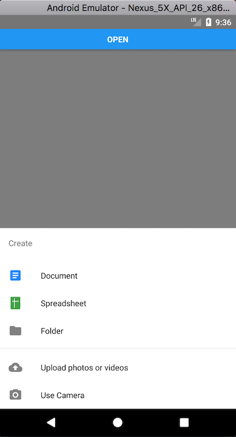

# react-native-js-bottom-sheet

Modal bottom sheet component for Android that follows the guidelines of Material Design.

https://material.io/guidelines/components/bottom-sheets.html

<p align="center">

</p>

## Getting startedgit s

```sh
$ yarn add react-native-js-bottom-sheet
```

## Usage

Code refers to the previous image example:

```js
/* @flow */

import React, { Component } from 'react'
import { AppRegistry, StyleSheet, Text, View, Button } from 'react-native'
import BottomSheet from 'react-native-js-bottom-sheet'
import MaterialCommunityIcons from 'react-native-vector-icons/MaterialCommunityIcons'
import Entypo from 'react-native-vector-icons/Entypo'

export default class Example extends Component {
  bottomSheet: BottomSheet

  _onPressButton = () => {
    this.bottomSheet.open()
  }

  render() {
    return (
      <View style={styles.container}>
        <Button title="Open" onPress={this._onPressButton} />
        <BottomSheet
          ref={(ref: BottomSheet) => {
            this.bottomSheet = ref
          }}
          itemDivider={3}
          backButtonEnabled={true}
          coverScreen={false}
          title="Create"
          options={[
            {
              title: 'Document',
              icon: (
                <MaterialCommunityIcons
                  name="file-document-box"
                  color="#2186fa"
                  size={24}
                />
              ),
              onPress: () => null
            },
            {
              title: 'Spreadsheet',
              icon: <Entypo name="spreadsheet" color="#43a047" size={24} />,
              onPress: () => null
            },
            {
              title: 'Folder',
              icon: (
                <MaterialCommunityIcons name="folder" color="grey" size={24} />
              ),
              onPress: () => null
            },
            {
              title: 'Upload photos or videos',
              icon: (
                <MaterialCommunityIcons
                  name="cloud-upload"
                  color="grey"
                  size={24}
                />
              ),
              onPress: () => null
            },
            {
              title: 'Use Camera',
              icon: (
                <MaterialCommunityIcons name="camera" color="grey" size={24} />
              ),
              onPress: () => null
            }
          ]}
          isOpen={false}
        />
      </View>
    )
  }
}
```

## API

| Prop              | Type          | Required | Description                                                                                                              |
| ----------------- | ------------- | -------- | ------------------------------------------------------------------------------------------------------------------------ |
| coverScreen       | bool          | No       | Will use RN Modal component to cover the entire screen wherever the modal is mounted in the component hierarchy          |
| backButtonEnabled | bool          | No       | Close modal when receiving back button event                                                                             |
| height            | number        | No       | Height of the container. By default it has no height, due to container grows automatically depending of list of elements |
| title             | string        | Yes      | Title displayed in top of list                                                                                           |
| options           | Array<Object> | Yes      | Array of objects to display options list                                                                                 |
| fontFamily        | string        | No       | Used to display values. By default is Roboto                                                                             |
| titleFontFamily   | string        | No       | Title font family                                                                                                        |
| isOpen            | bool          | No       | Specifies if bottom sheet is open by default                                                                             |
| itemDivider       | number        | No       | Insert an item separator below the specified item number                                                                 |

## License

MIT License

Copyright (c) 2017 InterfaceKit

## Author

Antonio Moreno Valls `<amoreno at apsl.net>`

Built with 💛 by [APSL](https://github.com/apsl).
